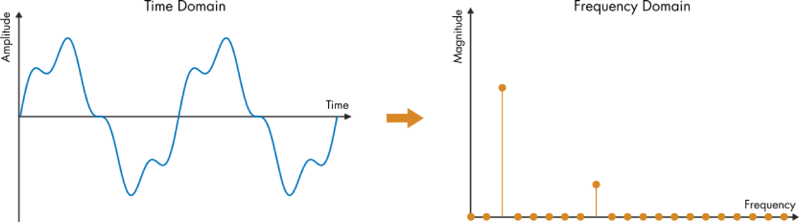
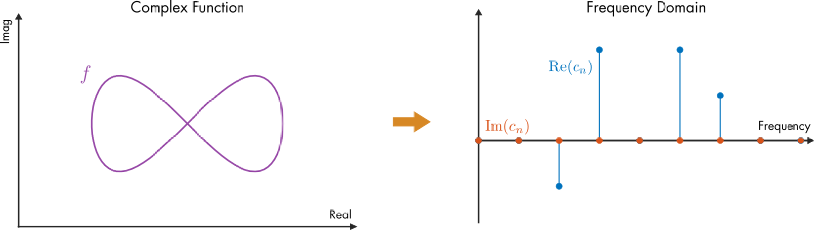
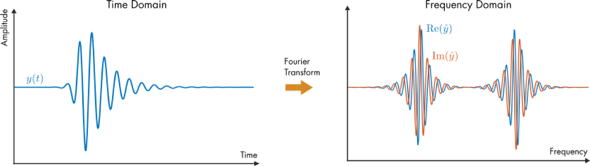
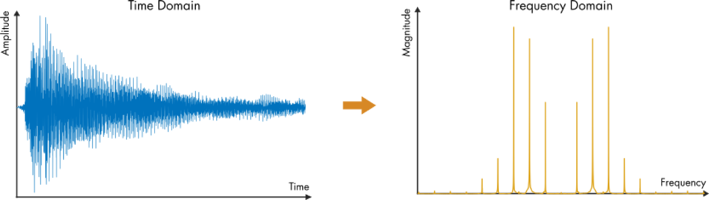
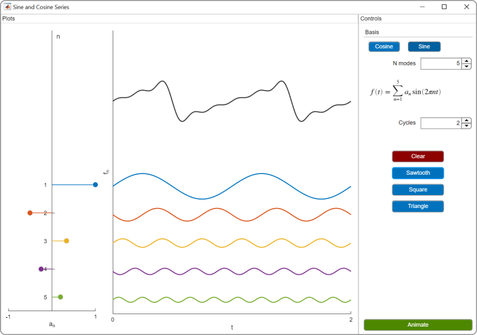
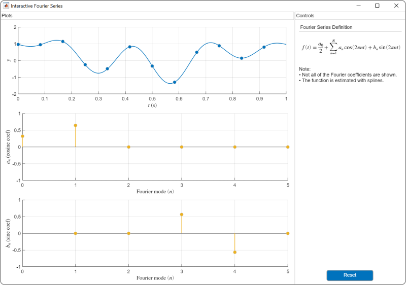
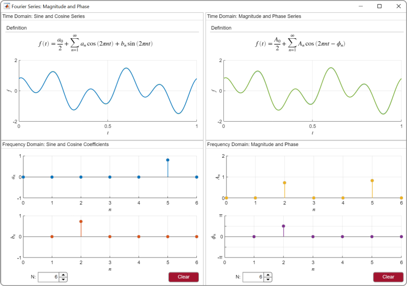
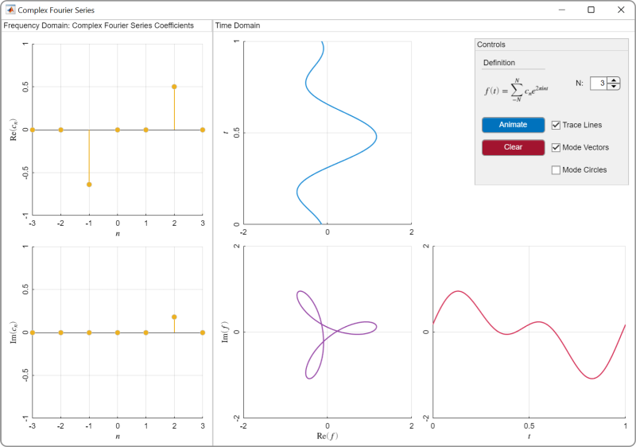

# Análisis de Fourier

# Información

Este módulo de currículum enseña análisis de Fourier utilizando [scripts interactivos](https://www.mathworks.com/products/matlab/live-editor.html) y [aplicaciones de MATLAB](https://www.mathworks.com/products/matlab/app-designer.html). El módulo se enseña desde una perspectiva de procesamiento de señales a un nivel adecuado para un curso introductorio de señales y sistemas. En la primera lección, los estudiantes usan aplicaciones para visualizar series de Fourier y desarrollar intuición sobre el dominio de la frecuencia. En lecciones posteriores, los estudiantes estudian series de Fourier complejas, transformadas de Fourier y transformadas de Fourier discretas. A medida que los estudiantes progresan, pasan de utilizar aplicaciones a escribir su propio código para analizar señales. A lo largo del módulo, los estudiantes aplican técnicas de Fourier para analizar señales de audio grabadas.

Cada tema incluye un laboratorio que aplica los conceptos enseñados en la lección. Las soluciones están disponibles bajo petición del instructor. Si desea solicitar soluciones, encuentra algún problema o tiene una sugerencia, envíe un correo electrónico al equipo de enseñanza en línea de MathWorks a onlineteaching@mathworks.com.

Este módulo ha sido traducido automáticamente del inglés.

## Antecedentes
1.  Asegúrese de tener todos los productos requeridos (listados a continuación) instalados. Si necesita incluir un producto, agréguelo utilizando el Explorador de complementos. Para instalar un complemento, vaya a la pestaña **Home** y seleccione   **Add-Ons** > **Get Add-Ons**.
2. Comience con cada tema haciendo clic en el enlace de la primera columna de la tabla a continuación para acceder al ejemplo introductorio. Las instrucciones dentro de cada script interactivo lo guiarán a través de la lección.
3. Complete la tarea de laboratorio ubicada en la última columna de la tabla para aplicar los conceptos.

## Productos

MATLAB®, Symbolic Math Toolbox™

# Módulos
## [**SerieDeFourier.mlx**](https://matlab.mathworks.com/open/github/v1?repo=MathWorks-Teaching-Resources/Fourier-Analysis_es&project=FourierAnalysis.prj&file=Scripts/SerieDeFourier.mlx)
|      |      |      |
| :-- | :-- | :-- |
|  | **En este script, los estudiantes...**    | **Tareas del laboratorio**     |
|     | $\bullet$ Comparar señales en los dominios del tiempo y la frecuencia.   $\bullet$ Analizar señales de audio en el dominio de la frecuencia.   $\bullet$ Visualizar modos de serie de Fourier.   $\bullet$ Describir cómo se representa el cambio de fase en una serie de Fourier.   $\bullet$ Discutir magnitud y fase.    | [Lab1\_SerieDeFourier.mlx](https://matlab.mathworks.com/open/github/v1?repo=MathWorks-Teaching-Resources/Fourier-Analysis_es&project=FourierAnalysis.prj&file=Scripts/Lab1_SerieDeFourier.mlx)     |
|      |      |       |

## [**FourierCompleja.mlx**](https://matlab.mathworks.com/open/github/v1?repo=MathWorks-Teaching-Resources/Fourier-Analysis_es&project=FourierAnalysis.prj&file=Scripts/FourierCompleja.mlx)
|      |      |      |
| :-- | :-- | :-- |
|  | **En este script, los estudiantes...**    | **Tareas del laboratorio**     |
|     | $\bullet$ Recordar la fórmula de Euler.   $\bullet$ Comparar series de Fourier complejas y reales.   $\bullet$ Visualizar series de Fourier complejas.   $\bullet$ Construir funciones utilizando series de Fourier complejas.    | [Lab2\_SerieDeFourierCompleja.mlx](https://matlab.mathworks.com/open/github/v1?repo=MathWorks-Teaching-Resources/Fourier-Analysis_es&project=FourierAnalysis.prj&file=Scripts/Lab2_SerieDeFourierCompleja.mlx)     |
|      |      |       |

## [**TransformadaDeFourier.mlx**](https://matlab.mathworks.com/open/github/v1?repo=MathWorks-Teaching-Resources/Fourier-Analysis_es&project=FourierAnalysis.prj&file=Scripts/TransformadaDeFourier.mlx)
|      |      |      |
| :-- | :-- | :-- |
|  | **En este script, los estudiantes...**    | **Tareas del laboratorio**     |
|     | $\bullet$ Comparar series de Fourier con la transformada de Fourier.   $\bullet$ Evaluar la transformada de Fourier de una función.   $\bullet$ Representar señales utilizando funciones continuas.   $\bullet$ Discutir ondas portadoras y modulación.   $\bullet$ Comparar funciones en los dominios del tiempo y la frecuencia utilizando la transformada de Fourier.    | [Lab3\_TransformadaFourier.mlx](https://matlab.mathworks.com/open/github/v1?repo=MathWorks-Teaching-Resources/Fourier-Analysis_es&project=FourierAnalysis.prj&file=Scripts/Lab3_TransformadaFourier.mlx)     |
|      |      |       |

## [**FourierDiscreta.mlx**](https://matlab.mathworks.com/open/github/v1?repo=MathWorks-Teaching-Resources/Fourier-Analysis_es&project=FourierAnalysis.prj&file=Scripts/FourierDiscreta.mlx)
|      |      |      |
| :-- | :-- | :-- |
|  | **En este script, los estudiantes...**    | **Tareas del laboratorio**     |
|     | $\bullet$ Graficar la transformada discreta de Fourier (DFT).   $\bullet$ Usar la función fft para calcular la DFT.   $\bullet$ Relacionar la DFT con la transformada de Fourier.   $\bullet$ Aplicar la DFT para analizar una señal de audio.    | [Lab4\_DFT\_es.mlx](https://matlab.mathworks.com/open/github/v1?repo=MathWorks-Teaching-Resources/Fourier-Analysis_es&project=FourierAnalysis.prj&file=Scripts/Lab4_DFT_es.mlx)     |
|      |      |       |

# Apps
|      |      |      |      |
| :-- | :-- | :-- | :-- |
| [Sine and Cosine Series app](matlab:run SinCosSeries.mlapp;)     | [Fourier Series app](matlab:run InteractiveFourierSeries.mlapp;)    |  [Magnitude and Phase app](matlab:run MagnitudePhase.mlapp;)     | [Complex Fourier Series app](matlab:run ComplexFourierSeries.mlapp)     |
|     |     |     |      |
|      |      |      |       |

# Educator Resources 
-  [Educator Page](https://www.mathworks.com/academia/educators.html) 

Copyright 2023 The MathWorks™, Inc

