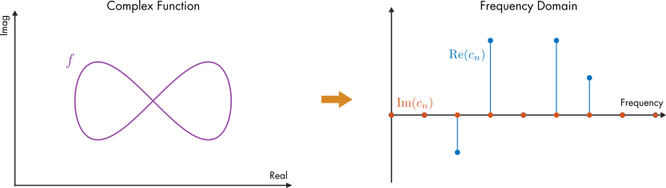
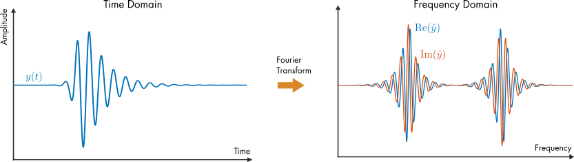
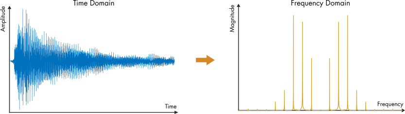
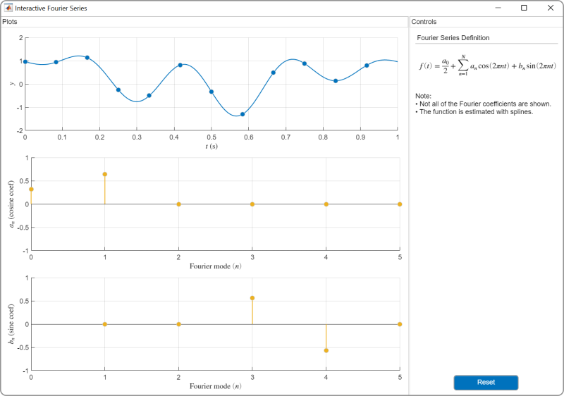
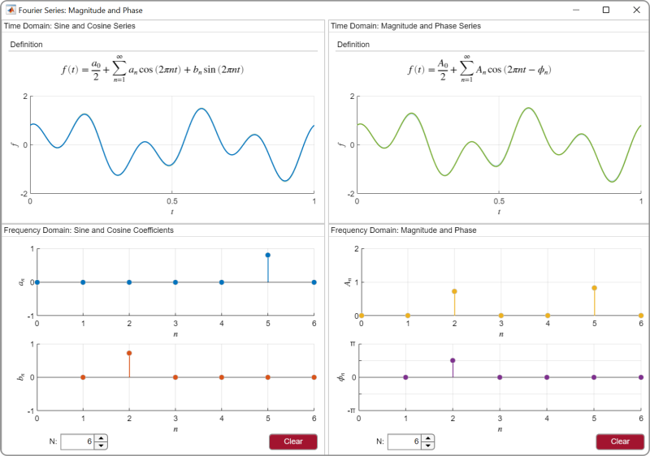
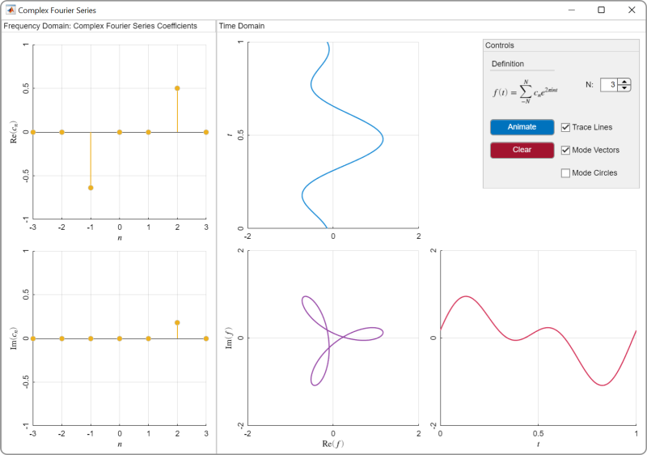

# Análisis de Fourier 
 o 

**Módulo Curricular**  
_Creado con R2021b. Compatible con R2021b y versiones posteriores._  

## Descripción ##
Este módulo curricular enseña el análisis de Fourier utilizando [live scripts](https://www.mathworks.com/products/matlab/live-editor.html) y [aplicaciones de MATLAB&reg;](https://www.mathworks.com/products/matlab/app-designer.html) interactivas. El módulo se enseña desde una perspectiva de procesamiento de señales, adecuada para un curso introductorio de señales y sistemas. En la primera lección, los estudiantes utilizan aplicaciones para visualizar series de Fourier y desarrollar intuición sobre el dominio de frecuencia. En lecciones posteriores, los estudiantes estudian series de Fourier complejas, transformadas de Fourier y transformadas de Fourier discretas. A medida que los estudiantes avanzan, pasan de utilizar aplicaciones a escribir su propio código para analizar señales. A lo largo del módulo, los estudiantes aplican técnicas de Fourier para analizar señales de audio grabadas.

Cada tema incluye un laboratorio que aplica los conceptos enseñados en la lección. Las soluciones están disponibles a solicitud del instructor. Si desea solicitar soluciones o tiene alguna pregunta, comuníquese con el <a href="mailto:onlineteaching@mathworks.com">equipo de enseñanza en línea de MathWorks.</a>

Comience con el módulo curricular de Análisis de Fourier descargando y descomprimiendo el repositorio. Luego, haga doble clic en el archivo .prj del proyecto dentro de MATLAB. A partir de ahí, puede seguir las instrucciones de la página de inicio para comenzar con los ejemplos y laboratorios.

Este módulo ha sido traducido automáticamente del inglés.

## Detalles ##

<table style="vertical-align:top">
  <tr>
    <th>Módulo</th>
    <th>Objetivos de Aprendizaje</th>
  </tr>
  <tr>
    <td>
        <b>1. Series de Fourier</b>  
        
    </td>
    <td>    
        <ul>
          <li>Comparar señales en los dominios de tiempo y frecuencia.</li>
          <li>Analizar señales de audio en el dominio de frecuencia.</li>
          <li>Visualizar modos de series de Fourier.</li>
          <li>Describir cómo se representa el desplazamiento de fase en una serie de Fourier.</li>
          <li>Discutir magnitud y fase.</li>
        </ul>
    </td>
  </tr>
  <tr>
    <td>
        <b>2. Series de Fourier Complejas</b>  
        
    </td>
    <td>    
        <ul>
          <li>Recordar la fórmula de Euler.</li>
          <li>Comparar series de Fourier complejas y reales.</li>
          <li>Visualizar series de Fourier complejas.</li>
          <li>Construir funciones utilizando series de Fourier complejas.</li>
        </ul>
    </td>
  </tr>
  <tr>
    <td>
        <b>3. Transformada de Fourier</b>  
        
    </td>
    <td>    
        <ul>
          <li>Comparar series de Fourier con la transformada de Fourier.</li>
          <li>Evaluar la transformada de Fourier de una función.</li>
          <li>Representar señales utilizando funciones continuas.</li>
          <li>Discutir ondas portadoras y modulación.</li>
          <li>Comparar funciones en los dominios de tiempo y frecuencia utilizando la transformada de Fourier.</li>
        </ul>
    </td>
  </tr>
  <tr>
    <td>
        <b> 4. Transformada Discreta de Fourier</b>  
        
    </td>
    <td>    
        <ul>
          <li>Graficar la transformada discreta de Fourier (DFT).</li>
          <li>Usar la función fft para calcular la DFT.</li>
          <li>Relacionar la DFT con la transformada de Fourier.</li>
          <li>Aplicar la DFT para analizar una señal de audio.</li>
        </ul>
    </td>
  </tr>
</table>

## Aplicaciones ##

<table style="vertical-align:top">
  <tr>
<td>
Series de Seno y Coseno  

</td>
<td>
Series de Fourier 

</td>
<td>
Magnitud y Fase 

</td>
<td>
Series de Fourier Complejas 

</td>
</tr>
</table>

## Preparación sugerida ##

[MATLAB Onramp](https://matlabacademy.mathworks.com/details/matlab-onramp/gettingstarted) - un tutorial introductorio gratuito de dos horas que enseña los conceptos esenciales de MATLAB.

## Productos ##

MATLAB, Symbolic Math Toolbox&trade;

## Licencia ##

La licencia para este módulo está disponible en el archivo [LICENSE.md](LICENSE.md) en este repositorio de GitHub.

## Recursos para educadores ##

* [Featured Courseware](https://www.mathworks.com/academia/courseware/course-materials.html)
* [Enseñar con MATLAB y Simulink](https://www.mathworks.com/academia/educators.html)
* [MATLAB Grader](https://www.mathworks.com/products/matlab-grader.html)

## ##

_Copyright 2023 The MathWorks, Inc._
